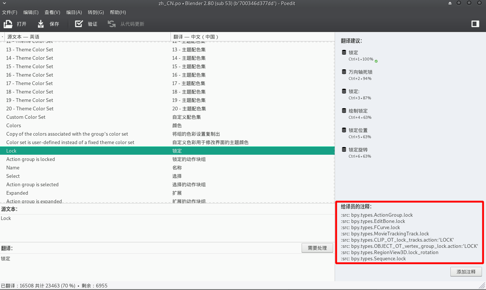

# 介绍

本项目意在以GitHub项目的方式维护Blender汉化文件。

在此之前，本人在百度贴吧开了一个[汉化报错帖](http://tieba.baidu.com/p/5530957667?pid=117496092864)。社区用户以回帖的方式反馈汉化的错漏，由本人统一维护提交。

近期本人突然意识到可以尝试用GitHub协作的方式完成UI的汉化，使用issue讨论用词争议。所以，也就新建了这个项目。

欢迎Blender用户提交修改，提报issue。

## 关于汉化UI的原理

Blender 的UI是通过 安装目录下的 `\datafiles\locale\zh_CN\LC_MESSAGES` 对应遗言文件夹下的 `blender.mo` 二进制文件实现多语言本地化的。

而 `blender.mo` 文件则是由 `.po` 文件编译而成的。本项目中的 `/zh_CN/zh_CN.po` 文件同步自[官方UI翻译项目](https://svn.blender.org/svnroot/bf-translations/branches/zh_CN/)。

官方推荐使用[poedit](https://poedit.net/download) 修改 `.po` 文件。这是目前可以找到的最好的`.po` 文件修改工具。poedit还有一个好处是保存文件过后会自动编译`.mo` 文件，编译后的`.mo` 文件改名并[替换](https://www.jianshu.com/p/e6fdda5dd103)本地Blender安装文件夹下的汉化文件，就可以直接看到UI下的效果了。

## 汉化时应注意的问题

1. 汉化时需对照UI，汉化后替换本地 `blender.mo`，检查错误：
2. 注意一词多义问题

   **一词多义** 问题一直是Blender汉化的痛点。同一个英文词条，在不同语境下意思不同。但是除去官方对部分词条开特例进行了 **语境提取**，其他一词多义的词条只能通过一些折中的办法(两个意思都写上，保留英文等)来解决。

   一次多义情况下，可以通过poedit打开 `zh_CN.po` 文件后显示的 `给译员的注释` 来推测UI用到该词条的位置，进而作出合理的判断与修改。

   

3. 提交修改前，建议同时提报issue。

## 关于issue的提报

建议按照以下格式提报issue：

1）错漏描述

2）UI中英对照截图

3）修改建议
