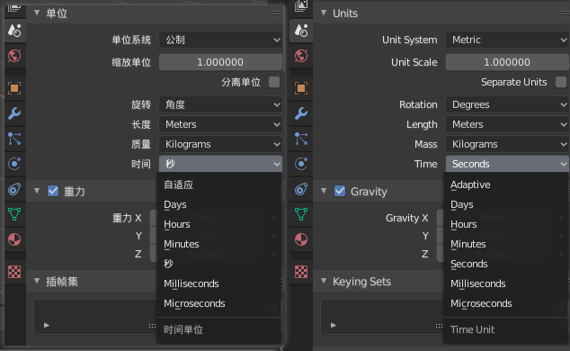
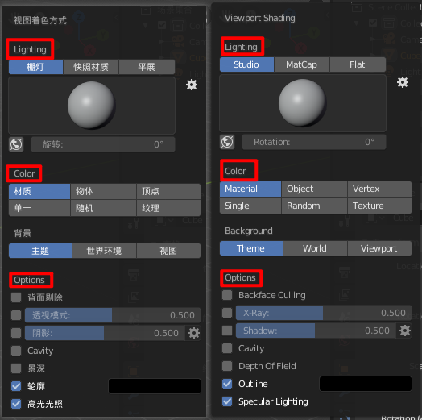
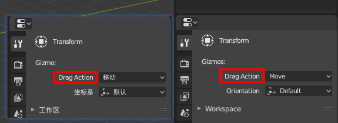

# Missing msgids

## 1. Sub menu of mirror

**Editor**: 3D View Editor

**Location**: `Object/Mesh/Curve/Surface/Metaball/Lattice/ --> Mirror --> X Local/Y Local/Z Local`

**Screenshot**:

## 2. Sub menu of Fractional Zoom

**Editor**: UV Editor

**Location**: `View --> Fractional Zoom --> Zoom x:x`

**Screenshot**:

## 3. Unit Presets

**Editor**: Property Editor

**Location**: 

`Scene --> Units --> Length --> Kilometers/Meters/Centimeters/Micrometers`

`Scene --> Units --> Mass --> Tonnes/Kilograms/Grams/Miligrams`

`Scene --> Units --> Time --> Days/Hours/Minutes/Miliseconds/Microseconds`

**Screenshot**:

## 4. Preference of Light

**Editor**: Preferences

**Location**: 

`Lights --> Studio Lights`

`Lights --> MatCaps`

`Lights --> LookDev HDRIS`

**Screenshot**:

## 5. Preference of Keymap

**Editor**: Preferences

**Location**: 

`Lights --> Preferences`

**Screenshot**:

## 5. Popup on exit

**Editor**: Popup on exit

**Location**: 

`This file has not been saved yet`

**Screenshot**:

## 6. Viewport Shading

**Editor**: 3D View

**Location**: 

`Display & Shading Menu --> Viewport Shading --> Lighting/Color/Options`

**Screenshot**:

## 7. Drag action of Gizmo

**Editor**: Property Editor

**Location**: 

`Context of Transform tool --> Gizmo --> Drag Action`

**Screenshot**:

